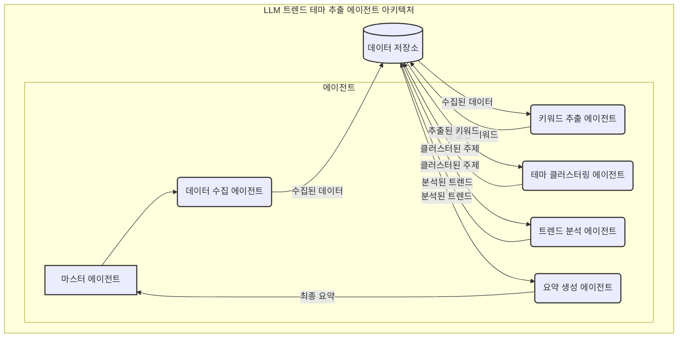

# LLM 기반 언급량 급증 테마 추출 AI 에이전트 개발 계획

## 1. 개요

본 계획서는 Google Agent Development Kit(ADK)와 Gemini API를 활용하여 언급량 급증 테마를 자동으로 감지하고 추출하는 AI 에이전트 시스템을 구현하기 위한 상세 개발 계획을 제시합니다.

### 1.1 시스템 목표

- 뉴스, 블로그, 카페 등 다양한 텍스트 소스에서 실시간으로 언급량이 급증하는 테마를 자동 감지
- 테마별 의미 있는 군집화 및 요약 제공
- 통계적 분석을 통한 트렌드 식별
- 확장 가능하고 유지보수가 용이한 에이전트 기반 아키텍처 구현

### 1.2 기술 스택

- **프레임워크**: Google Agent Development Kit (ADK)
- **LLM 기술**: Gemini API (gemini-2.0-pro 또는 gemini-2.0-flash)
- **언어**: Python 3.9+
- **데이터 저장**: 파일 시스템/JSON (초기), 필요시 데이터베이스 확장
- **API 연동**: 뉴스 API, 검색 API, 웹 크롤링 라이브러리

## 2. 아키텍처 설계

시스템은 Google ADK를 기반으로 한 다중 에이전트 아키텍처로 구성됩니다. 각 에이전트는 특정 역할을 담당하며 서로 협력하여 전체 파이프라인을 구성합니다.

### 2.1 에이전트 아키텍처 개요



- **디스패처 에이전트(MasterAgent)**: 전체 워크플로우를 조율하고 하위 에이전트들을 조정
- **데이터 수집 에이전트(DataCollectionAgent)**: 다양한 소스에서 데이터를 수집하는 역할 담당
- **키워드 추출 에이전트(KeywordExtractionAgent)**: 수집된 텍스트에서 주요 키워드를 추출
- **테마 군집화 에이전트(ThemeClusteringAgent)**: 키워드를 분석하여 의미 있는 테마로 군집화
- **트렌드 분석 에이전트(TrendAnalysisAgent)**: 언급량 통계 분석 및 급상승 테마 식별
- **요약 생성 에이전트(SummaryGenerationAgent)**: 최종 테마 요약 생성

### 2.2 에이전트 간 통신 및 데이터 흐름

에이전트 간 통신은 ADK의 위임(delegation) 메커니즘과 상태 관리를 통해 이루어집니다:

1. 디스패처 에이전트가 워크플로우 시작
2. 각 단계 에이전트에 순차적으로 작업 위임
3. 각 에이전트는 결과를 세션 상태(session state)에 저장
4. 다음 에이전트는 세션 상태에서 필요한 데이터를 읽어 처리
5. 최종 결과는 세션 상태에서 디스패처 에이전트로 반환

### 2.3 도구(Tools) 설계

각 에이전트는 특정 기능을 수행하기 위한 도구(Tools)를 활용합니다:

- **웹 검색 도구**: 뉴스 및 블로그 데이터 검색
- **API 호출 도구**: 다양한 데이터 소스 API 연동
- **크롤링 도구**: 웹사이트에서 데이터 추출
- **데이터 처리 도구**: 텍스트 정제, 통계 계산 등
- **저장소 접근 도구**: 데이터 저장 및 불러오기

## 3. 구성 요소별 상세 설계

### 3.1 데이터 수집 모듈

#### 3.1.1 뉴스 데이터 수집

- **NewsCollectionAgent 구현**
  - Google ADK `LlmAgent` 상속
  - 뉴스 API 호출 도구 정의 (NewsAPI, NYTimes API, 네이버 뉴스 검색 API)
  - 응답 데이터 파싱 및 정형화 (JSON → Python 객체)
  - 세션 상태에 수집 결과 저장

- **뉴스 크롤링 도구(NewsCrawlingTool) 구현**
  - ADK `Tool` 객체로 정의
  - Newspaper3k 또는 BeautifulSoup 기반 본문 추출
  - 크롤링 속도 제한 및 에러 처리

- **데이터 저장 도구(DataStorageTool) 구현**
  - 수집된 뉴스 데이터 저장 및 중복 방지
  - 세션 간 데이터 지속성 관리

#### 3.1.2 블로그/카페 데이터 수집

- **BlogCafeCollectionAgent 구현**
  - Google ADK `LlmAgent` 상속
  - 블로그/카페 API 호출 도구 정의 (네이버 블로그, 카페 검색 API)
  - 응답 데이터 정제 및 정규화

- **웹 크롤링 도구(WebCrawlingTool) 구현**
  - ADK `Tool` 객체로 정의
  - Playwright 기반 동적 콘텐츠 처리
  - 블로그/카페 본문 추출 로직

### 3.2 키워드 추출 모듈

- **KeywordExtractionAgent 구현**
  - Google ADK `LlmAgent` 상속
  - Gemini API 활용한 키워드 추출 프롬프트 최적화
  - 키워드 랭킹 및 필터링 로직

- **기능 설계**
  - 데이터 수집 에이전트의 결과를 세션 상태에서 로드
  - LLM을 활용한 주요 키워드 및 엔티티 추출
  - 키워드별 빈도수 계산 도구 연동
  - 출처별(뉴스/블로그/카페) 언급 빈도 집계
  - 결과를 세션 상태에 저장하여 다음 에이전트로 전달

### 3.3 테마 군집화 모듈

- **ThemeClusteringAgent 구현**
  - Google ADK `LlmAgent` 상속
  - 의미 기반 군집화 프롬프트 최적화
  - 테마 레이블링 및 관련도 점수 부여

- **기능 설계**
  - 키워드 추출 결과를 세션 상태에서 로드
  - LLM을 활용한 의미론적 유사성 기반 군집화
  - 각 군집에 대한 대표 테마명 생성
  - 군집별 총 언급량 및 주요 키워드 정리
  - 결과를 세션 상태에 저장

### 3.4 트렌드 분석 모듈

- **TrendAnalysisAgent 구현**
  - Google ADK `LlmAgent` 상속 
  - 통계 분석 도구 정의

- **통계 분석 도구(StatisticalAnalysisTool) 구현**
  - ADK `Tool` 객체로 정의
  - Z-스코어 계산 함수
  - 시계열 데이터 분석 함수

- **기능 설계**
  - 테마 군집화 결과 및 과거 데이터 로드
  - 테마별 Z-스코어 계산 (현재값과 과거 평균/표준편차 비교)
  - 상위 급상승 테마 선정 (Top 20)
  - 결과를 세션 상태에 저장

### 3.5 요약 생성 모듈

- **SummaryGenerationAgent 구현**
  - Google ADK `LlmAgent` 상속
  - 요약 최적화 프롬프트 설계

- **기능 설계**
  - 트렌드 분석 결과를 세션 상태에서 로드
  - 테마별 요약 문장 생성 (LLM 활용)
  - 출처별 언급 비중 포함
  - 요약 정보를 사용자 친화적인 형태로 포맷팅
  - 최종 결과를 세션 상태에 저장

### 3.6 디스패처 에이전트 설계

- **MasterAgent 구현**
  - Google ADK `Agent` 상속
  - 전체 워크플로우 조율

- **기능 설계**
  - 하위 에이전트 등록 및 관리
  - 순차적 에이전트 실행 조정
  - 에러 처리 및 재시도 전략
  - 최종 결과 취합 및 출력

## 4. ADK 구현 세부 사항

### 4.1 에이전트 정의 예시

```python
from google.adk import Agent, LlmAgent, Tool, Session
from google.adk.types import Part

class KeywordExtractionAgent(LlmAgent):
    def __init__(self):
        super().__init__(
            name="KeywordExtractionAgent",
            description="텍스트 데이터에서 주요 키워드와 엔티티를 추출합니다.",
            model="gemini-2.0-pro",
            instruction="""
            당신은 텍스트 데이터에서 주요 키워드와 엔티티를 추출하는 전문가입니다.
            주어진 뉴스, 블로그, 카페 글 등에서 빈번히 언급되는 중요 키워드를 추출하세요.
            키워드는 인물, 조직, 이벤트, 제품, 기술, 주제 등 다양한 유형을 포함해야 합니다.
            결과는 JSON 형식으로 반환하세요.
            """
        )
        
        # 도구 등록
        self.tools = [
            calculate_keyword_frequency,
            filter_common_words
        ]
    
    # 필요한 메서드 구현
```

### 4.2 도구(Tool) 정의 예시

```python
from google.adk import Tool
from typing import List, Dict, Any

@Tool(description="텍스트 내 키워드 빈도를 계산합니다.")
def calculate_keyword_frequency(texts: List[Dict[str, Any]]) -> Dict[str, int]:
    """
    주어진 텍스트 목록에서 키워드 출현 빈도를 계산합니다.
    
    Args:
        texts: 텍스트 데이터 목록. 각 항목은 딕셔너리로 title, content, source 등을 포함.
        
    Returns:
        키워드와 해당 빈도를 매핑한 딕셔너리
    """
    # 키워드 빈도 계산 로직 구현
    frequency = {}
    # 구현...
    return frequency
```

### 4.3 에이전트 간 데이터 공유

Google ADK의 세션 상태를 활용하여 에이전트 간 데이터를 공유합니다:

```python
# 데이터 저장
def process(self, ctx: Session):
    # 처리 로직...
    ctx.state["collected_data"] = collected_data
    return "데이터 수집 완료"

# 다른 에이전트에서 데이터 로드
def process(self, ctx: Session):
    collected_data = ctx.state.get("collected_data", [])
    # 처리 로직...
```

### 4.4 워크플로우 관리

워크플로우는 디스패처 에이전트를 통해 관리됩니다:

```python
from google.adk.agents import SequentialAgent

# 순차적 워크플로우 정의
workflow_agent = SequentialAgent(
    name="TrendExtractionWorkflow",
    description="언급량 급증 테마 추출 워크플로우",
    agents=[
        data_collection_agent,
        keyword_extraction_agent,
        theme_clustering_agent,
        trend_analysis_agent,
        summary_generation_agent
    ]
)
```

## 5. 데이터 처리 및 에이전트 프롬프트 설계

### 5.1 데이터 수집 에이전트 프롬프트

```
당신은 다양한 소스에서 최신 텍스트 데이터를 수집하는 에이전트입니다.
다음 작업을 수행하세요:

1. 제공된 API를 사용하여 최근 24시간 내의 뉴스 기사를 수집하세요.
2. 제공된 API를 사용하여 최근 24시간 내의 블로그 및 카페 게시글을 수집하세요.
3. 필요한 경우 웹 크롤링 도구를 사용하여 추가 데이터를 수집하세요.
4. 수집된 데이터를 표준 형식으로 정리하여 반환하세요.

수집 결과는 다음 JSON 형식으로 반환하세요:
{
  "news": [ {"title": "...", "content": "...", "source": "...", "published": "..."}, ... ],
  "blogs": [ {"title": "...", "content": "...", "author": "...", "published": "..."}, ... ],
  "cafes": [ {"title": "...", "content": "...", "cafe": "...", "published": "..."}, ... ]
}
```

### 5.2 키워드 추출 에이전트 프롬프트

```
당신은 텍스트 데이터에서 주요 키워드와 엔티티를 추출하는 전문가입니다.
다음 작업을 수행하세요:

1. 제공된 뉴스, 블로그, 카페 글에서 자주 언급되는 중요 키워드를 추출하세요.
2. 키워드는 인물, 조직, 이벤트, 제품, 기술, 주제 등 다양한 유형을 포함해야 합니다.
3. 각 키워드의 출현 빈도를 계산하고, 출처별(뉴스/블로그/카페) 언급 횟수를 집계하세요.

결과는 다음 JSON 형식으로 반환하세요:
[
  {
    "keyword": "키워드1",
    "frequency": {
      "total": 15,
      "news": 10,
      "blogs": 3,
      "cafes": 2
    }
  },
  ...
]
```

### 5.3 테마 군집화 에이전트 프롬프트

```
당신은 키워드를 분석하여 의미 있는 테마로 군집화하는 전문가입니다.
다음 작업을 수행하세요:

1. 제공된 키워드 목록과 빈도 정보를 분석하세요.
2. 의미적으로 유사하거나 연관된 키워드들을 하나의 테마로 군집화하세요.
3. 각 테마에 적절한 대표 이름을 부여하세요.
4. 각 테마의 총 언급량과 포함된 키워드를 정리하세요.

결과는 다음 JSON 형식으로 반환하세요:
[
  {
    "theme": "테마명",
    "keywords": ["키워드1", "키워드2", ...],
    "mentions": {
      "total": 45,
      "news": 30,
      "blogs": 10,
      "cafes": 5
    }
  },
  ...
]
```

### 5.4 트렌드 분석 에이전트 프롬프트

```
당신은 테마별 언급량을 분석하여 급상승 트렌드를 식별하는 전문가입니다.
다음 작업을 수행하세요:

1. 제공된 테마 목록과 현재 언급량 정보를 분석하세요.
2. 각 테마의 과거 평균 언급량과 표준편차 정보를 사용하여 Z-스코어를 계산하세요.
3. Z-스코어가 가장 높은 상위 20개 테마를 선정하세요.
4. 선정된 테마들의 순위와 관련 데이터를 정리하세요.

결과는 다음 JSON 형식으로 반환하세요:
[
  {
    "rank": 1,
    "theme": "테마명",
    "z_score": 3.75,
    "current_mentions": 45,
    "average_mentions": 20,
    "std_dev": 6.67,
    "keywords": ["키워드1", "키워드2", ...],
    "mentions_by_source": {"news": 30, "blogs": 10, "cafes": 5}
  },
  ...
]
```

### 5.5 요약 생성 에이전트 프롬프트

```
당신은 테마 분석 결과를 바탕으로 이해하기 쉬운 요약을 생성하는 전문가입니다.
다음 작업을 수행하세요:

1. 제공된 급상승 테마 목록을 분석하세요.
2. 각 테마에 대해 핵심 내용을 파악하고 1-2문장으로 요약하세요.
3. 요약은 해당 테마가 왜 주목받고 있는지 이해할 수 있도록 작성하세요.
4. 각 테마의 출처별 언급 비중과 관련 키워드 정보를 포함하세요.

결과는 다음 JSON 형식으로 반환하세요:
[
  {
    "rank": 1,
    "theme": "테마명",
    "summary": "해당 테마에 대한 1-2문장 요약",
    "keywords": ["키워드1", "키워드2", ...],
    "mentions_by_source": {"news": 30, "blogs": 10, "cafes": 5}
  },
  ...
]
```

## 6. 시스템 통합 및 출력

### 6.1 JSON 출력 형식

최종 출력은 구조화된 JSON 형식으로 제공되어 다양한 용도로 활용 가능하게 합니다:

```json
{
  "timestamp": "2025-04-20T15:00:00+09:00",
  "trending_themes": [
    {
      "rank": 1,
      "theme": "전기차 배터리 기술",
      "z_score": 3.75,
      "mentions_total": 39,
      "mentions_detail": {"news": 25, "blogs": 10, "cafes": 4},
      "keywords": ["전기차 배터리", "삼성전자", "LG에너지솔루션", "테슬라"],
      "summary": "여러 완성차 및 배터리 기업들이 전기차용 차세대 배터리 기술 개발과 투자를 발표하면서 관련 논의가 크게 증가했습니다."
    },
    // ... 다른 테마들
  ]
}
```

### 6.2 콘솔 출력 포맷

콘솔 출력은 사용자 친화적인 형태로 제공됩니다:

```
[급상승 테마 Top 20 - 2025/04/20 15:00 기준]

1. 전기차 배터리 기술 (언급량: 39회 | 뉴스 25, 블로그 10, 카페 4)  
   - 여러 완성차 및 배터리 기업의 차세대 전기차 배터리 기술 개발 발표로 관련 논의가 급증했습니다.

2. 프로야구 2025 개막 (언급량: 18회 | 뉴스 5, 블로그 8, 카페 5)  
   - 2025시즌 프로야구가 개막하면서 개막전 경기 결과와 선수단 소식이 팬 커뮤니티를 달구고 있습니다.

// ... 다른 테마들
```

### 6.3 ADK 웹 인터페이스 통합

Google ADK의 웹 인터페이스를 활용하여 대화형 인터페이스 제공:

```bash
# ADK 웹 인터페이스 실행
adk web .
```

## 7. 개발 및 구현 계획

### 7.1 개발 단계

1. **기본 에이전트 프레임워크 구축** (1주)
   - ADK 설정 및 기본 에이전트 구조 정의
   - 데이터 모델 및 상태 관리 구현

2. **데이터 수집 모듈 구현** (2주)
   - 뉴스 및 블로그/카페 API 연동
   - 크롤링 도구 개발
   - 초기 데이터 파이프라인 테스트

3. **키워드 추출 및 테마 군집화 모듈 구현** (2주)
   - Gemini API 연동 및 프롬프트 최적화
   - 키워드 추출 에이전트 구현
   - 테마 군집화 에이전트 구현

4. **트렌드 분석 및 요약 모듈 구현** (2주)
   - 통계 분석 도구 개발
   - Z-스코어 계산 및 랭킹 시스템 구현
   - 요약 생성 에이전트 구현

5. **시스템 통합 및 테스트** (1주)
   - 전체 에이전트 파이프라인 통합
   - 오류 처리 및 성능 최적화
   - 사용자 인터페이스 개선

6. **확장 기능 구현** (2주)
   - 자동화된 콘텐츠 생성 기능
   - 블로그/SNS 자동 게시 기능
   - 알림 시스템 구현

### 7.2 개발 환경 및 요구사항

- **개발 언어**: Python 3.9+
- **핵심 라이브러리**:
  - google-adk: Google Agent Development Kit
  - google-generativeai: Gemini API 클라이언트
  - requests: HTTP 요청
  - beautifulsoup4: HTML 파싱
  - playwright: 웹 크롤링
  - numpy/pandas: 데이터 처리 및 통계 분석
  - pydantic: 데이터 모델 및 유효성 검증

- **시스템 요구사항**:
  - CPU: 4코어 이상
  - RAM: 8GB 이상
  - 디스크: 10GB 이상
  - 인터넷 연결: 안정적인 고속 연결
  - API 키: Gemini API, NewsAPI 등

### 7.3 테스트 계획

1. **단위 테스트**:
   - 개별 에이전트 기능 테스트
   - API 호출 및 파싱 로직 테스트
   - 프롬프트 응답 테스트

2. **통합 테스트**:
   - 에이전트 간 데이터 흐름 테스트
   - 세션 상태 관리 테스트
   - 전체 워크플로우 검증

3. **성능 테스트**:
   - 데이터 수집 속도 및 효율성 테스트
   - LLM 응답 시간 측정
   - 대량 데이터 처리 성능 평가

4. **사용자 경험 테스트**:
   - 결과 품질 평가
   - 출력 형식 적합성 검증
   - 실제 사용 시나리오 검증

## 8. 운영 및 유지보수 계획

### 8.1 배포 전략

- **개발 환경**: ADK CLI를 활용한 로컬 실행 및 테스트
- **스테이징 환경**: Docker 컨테이너화를 통한 테스트 서버 배포
- **프로덕션 환경**: Google Cloud Run 또는 Kubernetes를 활용한 확장 가능한 배포

### 8.2 모니터링 및 알림

- 에이전트 실행 로그 기록 및 분석
- API 호출 모니터링 및 할당량 관리
- 오류 발생 시 알림 시스템 구축

### 8.3 데이터 관리

- 과거 데이터 보관 정책
- 백업 및 복구 전략
- 데이터 품질 모니터링

## 9. 자원 할당 및 역할

### 9.1 개발 인력 구성
- 백엔드 개발자: 시스템 코어 및 데이터 처리
- AI 엔지니어: ADK 에이전트 설계 및 프롬프트 최적화
- 데이터 엔지니어: 데이터 수집 및 크롤링 모듈
- DevOps: 배포 및 운영 환경 구성

### 9.2 외부 자원 할당
- Gemini API 예산 계획
- 뉴스 및 검색 API 사용량 예측
- 인프라 리소스 할당 계획

## 10. 위험 요소 및 대응 계획

### 10.1 기술적 위험
- Gemini API 장애 대응 방안
- 데이터 소스 접근 제한 시 대안
- 키워드 추출 품질 저하 시 보완책

### 10.2 일정 위험
- 개발 지연 요소 식별
- 단계별 우선순위 조정 방안
- 빠른 MVP 구축 전략

### 10.3 비용 위험
- API 호출 비용 제어 방안
- 리소스 사용 최적화 전략
- 비용 효율적 대안 평가

## 11. 결론 및 기대효과

본 개발 계획은 Google ADK와 Gemini API를 활용한 언급량 급증 테마 추출 AI 에이전트를 구현하기 위한 상세 로드맵을 제시합니다. ADK 기반의 다중 에이전트 아키텍처를 통해 기본 기능부터 고급 확장 기능까지 체계적으로 개발하며, 모듈식 구조를 통해 유연성과 확장성을 확보합니다.

완성된 시스템은 다양한 온라인 텍스트 소스에서 실시간으로 언급량이 급증하는 테마를 자동으로 감지하고 요약함으로써, 트렌드 모니터링 업무를 효율화하고 데이터 기반 인사이트를 제공할 것입니다. 또한 이 시스템은 향후 자동화된 콘텐츠 생성 및 배포 시스템으로 확장될 수 있는 기반을 마련합니다.

개발 과정에서 발생할 수 있는 위험 요소들에 대한 대응 방안을 사전에 마련하고, 유연한 접근 방식을 통해 프로젝트의 성공적인 완수를 도모합니다. 