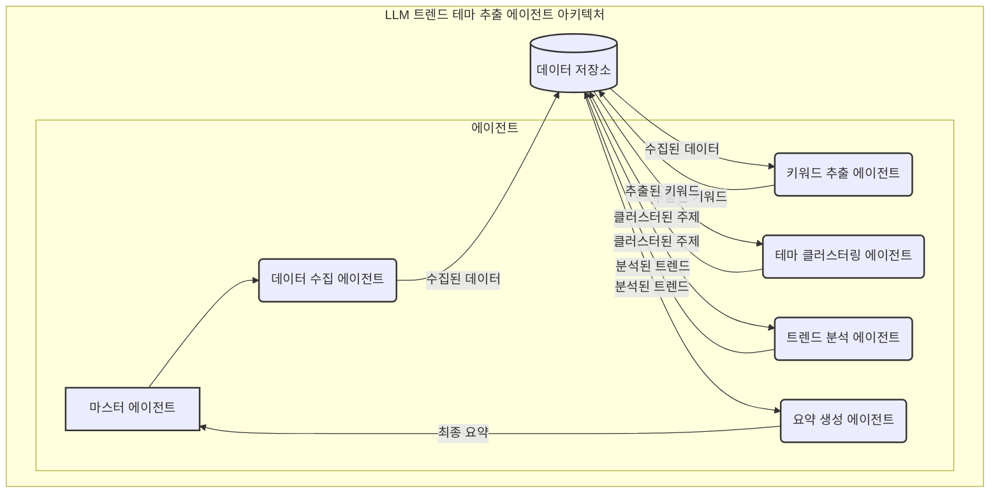

```mermaid
graph TD
    subgraph "LLM 트렌드 테마 추출 에이전트 아키텍처"
        direction LR

        MA[마스터 에이전트] --> DCA(데이터 수집 에이전트)
        DCA -->|수집된 데이터| DR[(데이터 저장소)]
        DR -->|수집된 데이터| KEA(키워드 추출 에이전트)
        KEA -->|추출된 키워드| DR
        DR -->|추출된 키워드| TCA(테마 클러스터링 에이전트)
        TCA -->|클러스터된 주제| DR
        DR -->|클러스터된 주제| TAA(트렌드 분석 에이전트)
        TAA -->|분석된 트렌드| DR
        DR -->|분석된 트렌드| SGA(요약 생성 에이전트)
        SGA -->|최종 요약| MA

        subgraph "에이전트"
          MA
          DCA
          KEA
          TCA
          TAA
          SGA
        end
    end

    classDef agent fill:#lightblue,stroke:#333,stroke-width:2px;
    classDef master fill:#lightcoral,stroke:#333,stroke-width:2px;
    classDef repo fill:#lightgrey,stroke:#333,stroke-width:2px;

    class MA master;
    class DCA,KEA,TCA,TAA,SGA agent;
    class DR repo;
``` 